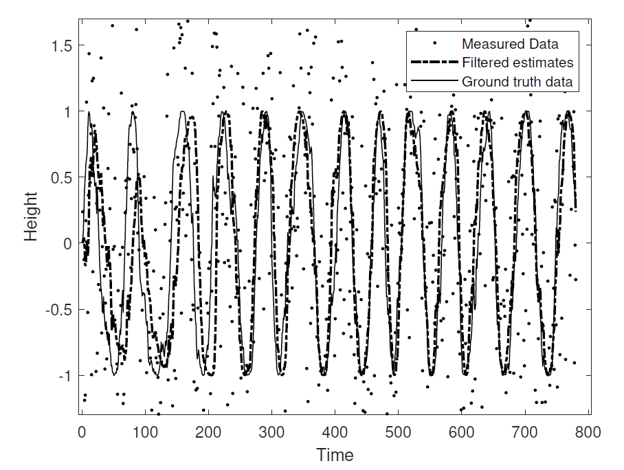

# Extended Kalman Filtering

Kalman filters can be applied when both the system and the measurements are linear in nature but if either of them becomes non linear like the case of RADAR measurement , 
wherein it is measuring an object that follows linear  behaviour but the measurements are in terms of polar coordinates (range and azhimuth), in that case we can no longer apply Kalman filters.

Hence we apply Extended Kalman filter where we linearize the non linear models using Jacobian matrix locally and then apply an hypothetical Kalman filter to determine the gain and thereby the filtered data.

In this case , a timeseries data was provided that resembled sine wave , EKF was applied to this data series to track the position. 
The filted data was compared against the groundtruth data provided. The timeseries data can be found in EKF_data.mat. The MATLAB code for EKF can be found in EKF.m.

