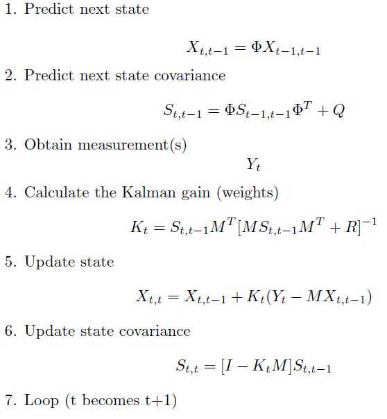
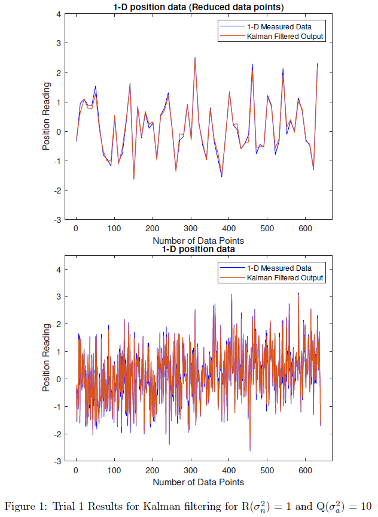
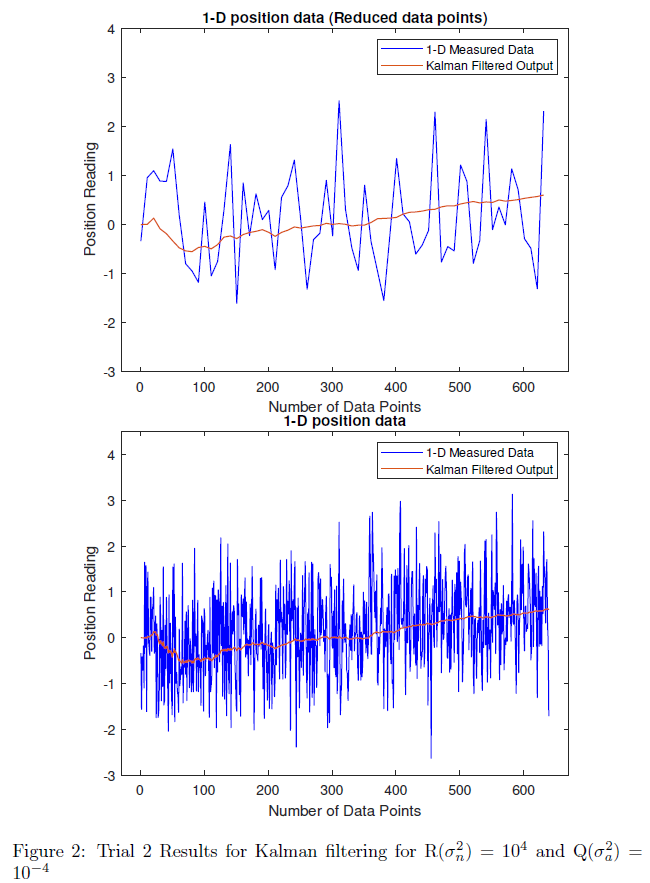
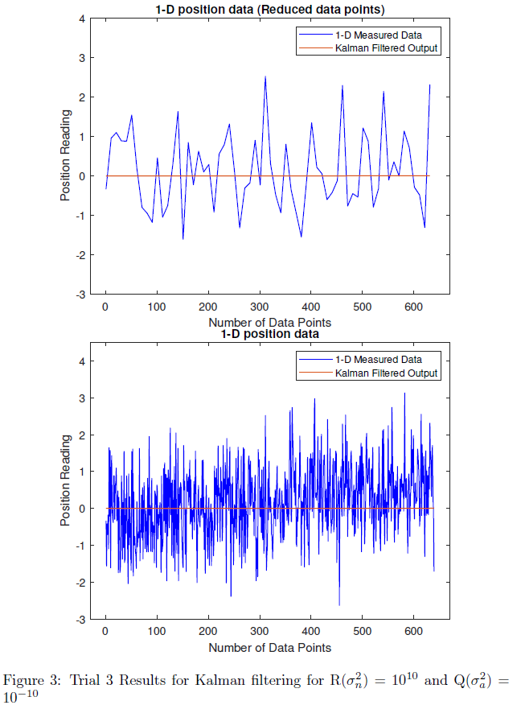

# Kalman Filtering

In this project, Kalman filtering has been applied for 1 dimensional and 2 dimensional measurement data. 
In both the cases constant velocity model has been applied.

The input data that contains noise can be found in "1D-data.txt" and "2D-UWB-data.txt".
The aim of Kalman filtering is to estimate the near accurate value given system noise and meanurement noise are known or approximated.

Kalman filtering is done with set of equations that continuously predict and
update the value. Firstly, the next state and the state covariance are predicted.
After the prediction, the sensor recorded measurement is obtained and Kalman
gain is calculated. The Kalman gain consists of weights that are applied to the
prediction and the measured value. Based on this Kalman gain, the state and
state covariance is updated. The updated state provides final output for that
particular state and this cycle is repeated over time. The following equations
define Kalman filtering:

For 1-D and 2-D data, respective measurement noise covariance, dynamic noise covariance, and state transition equations were defined.
All of the equations and matrices used and method is explained in Lab4_Kalman_FIlter.pdf

# Results
In this project, effects of various measurement noise covariance R and dynamic noise covariance Q values were tested as shown in the following results for 1-D data.

More results and analysis is available in Lab4_Kalman_FIlter.pdf
